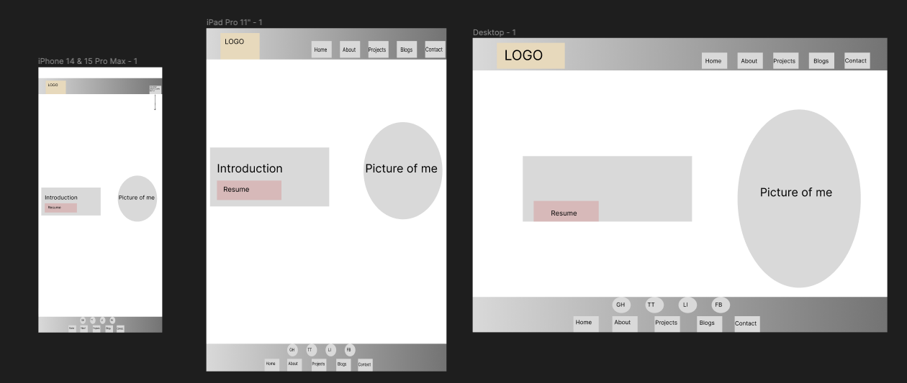

# T1-A2-Portfolio- Sharla Gilbert

## Website Link:
https://sharla-gilbert-t1-a2-portfolio.netlify.app/

## GitHub repo:
https://github.com/shgil1/T1-A2-Portfolio

## Purpose
This portfolio assignment is intended to showcase my skills, projects and experiences as an aspiring web developer. My aim is to not only showcase my technical skills but also my personality to potential employers.

## Functionality/Features
1. Main Navigation Bar
- The main navigation bar is present at the top of each page to allow users to easily access all pages across the site, this includes the home, about me, projects, blogs and contact pages. When using a mobile device the nav bar will easily be accessed via a drop down menu. 

2. Logo
- I designed my own custom logo on canva by incorporating my love of animals and my name written in Japanese. When selected, this logo allows users to return to the home page. 

3. Social Media Navigation Bar
- This is located in the footer of each page and is represented by the respective media icon. When selected, a new tab opens in the browser to the corresponding platform. I have linked my github, facebook, tiktok and linkedin to allow various ways to contact me.

4. Blog Posts
- I designed each blog post image to showcase my passion of animals and healthcare. There is a read more button located on each post and when selected, it will lead users to a dedicated blog post page. There is a "back to blog" button located at the bottom of each post to allow users to return to the main blog page. 

5. Footer
- The footer navigation bar at the bottom of every page was designed to allow users to easily click on the corresponding icon to open up my respective social media page in a new tab. Below the social icons is the menu navigation bar allowing users to navigate to any page of the website no matter where they are on the site. Below that is a small footer bar allowing users to see that I designed this website. 

6. Buttons
- I have included a button for my resume on the home page designed to be easily accessible to users as it opens in a new tab. I have also included 'read more' buttons on each blog post in the main blog page to allow users to read the entire blog post on a seperate page in a new tab. On each blog post there is a 'back to blog page' button allowing users to easily return to the main blog page after each post.  

### Screenshots
- I do not have any design background but I decided on the aesthetic of the website to be minimal and using earthy tones. I used a colour pallete that I generated from coolors and selected each colour. 
- For the about me page I selected a background image that was Japanese themed to incorporate my Japanese heritage. 
- For the blog post page I used this page as catalyst to showcase my love for my pets and animals. Animal rescue is a huge part of my life and I wanted to include as many images of my animals as I could. 
- The following screenshots of the wireframes created for each page on different devices in the order they appear on the website:

Home Page:

About Me Page:

Projects Page:

Blog Page:

Blog Post Page: 

- Each blog post will have the same layout including a button that allows users to navigate back to the main blog page after each post

Contact Me Page:

## Sitemap
- The following screenshot is of the sitemap I created when I first drafted my design for how the website layout will be:

- There are 5 main pages of the site which include:
1. Home page
2. About Me page
3. Projects page with 3 posts
4. Blog page with 5 blog posts
5. Contact Me page

## Target audience
This portfolio is designed to demonstrate my skills and abilities to potential employers in the IT sector. I intended to highlight my previous background knowledge in healthcare and my desire to implement that in the tech space and garner interest from IT employers to collaborate in the future. 

## Tech stack
This assignment has allowed me to expand my knowledge and skills in writing HTML as well as styling each page with CSS. I utilisted both flexbox and css grid depending on my desired outcome and through a lot of trial and error I have learnt a lot about which property is best to achieve a desired layouts. 

Technology used in this portfolio:
- HTML
- CSS
- JS

Websites used in this portfolio:
- GitHub
- Figma 
- Trello
- Coolors
- Colourcontrast

Application used to build this portfolio:
- VSCode